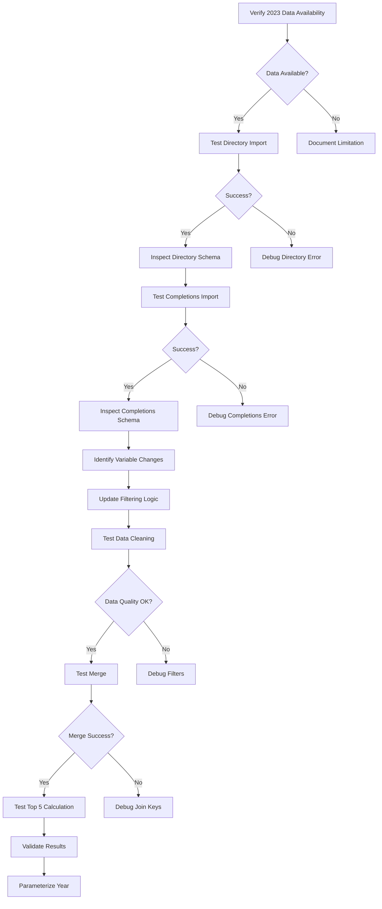

# Design Document

## Overview

This design outlines an **interactive debugging approach** to update the `community_college_completion_RDD.Rmd` script from analyzing 2022 IPEDS data to 2023 IPEDS data. Since the exact cause of failure when changing the year is unknown, we'll use an incremental testing methodology where each step is validated before proceeding. This approach will help identify whether the issue is with data availability, variable name changes, or data schema modifications.

The design prioritizes:
1. **Minimal changes** - Only update what's necessary
2. **Incremental testing** - Test each change immediately
3. **Clear diagnostics** - Capture detailed information at each step
4. **Fallback options** - Have alternatives if primary approach fails

## Steering Document Alignment

### Technical Standards (tech.md)

This design follows the console-based interactive workflow documented in `tech.md`:
- **R Markdown for reproducibility**: All changes remain within the R Markdown document
- **Incremental testing**: Each code chunk will be tested independently in the RStudio console before knitting
- **Console output**: Use `cat()`, `str()`, and `names()` to inspect data structures
- **educationdata package**: Continue using the Urban Institute's R client rather than raw API calls
- **CSV exports**: No changes to the data persistence strategy

### Project Structure (structure.md)

This design maintains the existing R Markdown structure:
- **File naming**: Keep `community_college_completion_RDD.Rmd` (already uses snake_case)
- **Chunk organization**: Maintain the current pattern (setup → imports → cleaning → merging → analysis)
- **Variable naming**: Continue using `snake_case` for all variables
- **Comments**: Add inline comments to document year-related changes
- **Script organization**: No restructuring - only targeted updates

## Code Reuse Analysis

### Existing Components to Leverage

- **`get_education_data()` function**: From the `educationdata` package - no changes needed to the function itself, only the parameters
- **Data cleaning pipeline**: The `dplyr` chain in the cleaning chunks can be reused with potential variable name updates
- **Merge logic**: The `left_join()` operation should work identically if join keys haven't changed
- **Top 5 ranking logic**: The `slice_max()` operation should work identically if schema is consistent

### Integration Points

- **educationdata package**: Will need to verify 2023 support by checking package version and documentation
- **IPEDS API backend**: The Urban Institute API must have 2023 data available
- **Directory dataset**: Carnegie classification variable may need updating
- **Completions-cip-6 dataset**: Variable names must be validated

## Architecture

This is a **data pipeline modification**, not a software architecture change. The design follows a diagnostic workflow:



### Diagnostic Testing Stages

**Stage 1: Data Availability Verification**
- Test if `get_education_data()` accepts `year = 2023`
- Check package version and documentation
- Identify any error messages

**Stage 2: Directory Data Import**
- Import directory data for 2023 with minimal filters
- Inspect column names using `names(dir_data)`
- Check for Carnegie classification variables (`cc_basic_2021`, `cc_basic_2023`, etc.)
- Validate Florida records exist

**Stage 3: Completions Data Import**
- Import completions-cip-6 data for 2023 with minimal filters
- Inspect column names using `names(comp_data)`
- Verify `awards_6digit` variable exists
- Validate Florida records exist

**Stage 4: Schema Validation**
- Compare 2023 column names to 2022 column names
- Identify any renamed or removed variables
- Document required changes

**Stage 5: Filter Updates**
- Update Carnegie classification variable if needed
- Test each filter incrementally
- Verify record counts at each step

**Stage 6: Merge Testing**
- Test join on existing keys (`unitid`, `year`, `fips`)
- Verify merge produces expected row counts
- Check for NA values in key columns

**Stage 7: Analysis Validation**
- Run top 5 calculation
- Compare results to 2022 for reasonableness
- Verify each institution has results

## Components and Interfaces

### Component 1: Data Import Chunks

**Purpose:** Import directory and completions-cip-6 data for the specified year

**Current Implementation:**
```r
dir_data <- get_education_data(
  level = "college-university",
  source = "ipeds",
  topic = "directory",
  filters = list(year = 2022)
)
```

**Modified Design:**
```r
# Set year parameter at top of document
YEAR <- 2023

# Test import with diagnostic output
cat(sprintf("Attempting to import directory data for %d...\n", YEAR))
dir_data <- get_education_data(
  level = "college-university",
  source = "ipeds",
  topic = "directory",
  filters = list(year = YEAR)
)
cat(sprintf("Successfully imported %d rows\n", nrow(dir_data)))
cat("Column names:\n")
print(names(dir_data))
```

**Dependencies:**
- `educationdata` package
- `dplyr` package

**Reuses:**
- Existing `get_education_data()` API
- Existing chunk structure

### Component 2: Directory Cleaning Chunk

**Purpose:** Filter directory data for Florida public community colleges

**Current Implementation:**
```r
clean_dir <- dir_data %>%
  select(unitid, year, opeid, fips, sector, inst_control, cc_basic_2021, inst_name) %>%
  filter(fips == 12, opeid != "-2", inst_control == 1,
         ((cc_basic_2021 >= 1 & cc_basic_2021 <= 8) | cc_basic_2021 == 14 | cc_basic_2021 == 23) & cc_basic_2021 > 0,
         !is.na(inst_name))
```

**Modified Design:**
```r
# First, identify the Carnegie classification variable
cc_vars <- grep("^cc_basic_", names(dir_data), value = TRUE)
cat("Available Carnegie classification variables:", cc_vars, "\n")

# Select the most recent Carnegie classification variable
# For 2023 data, this might be cc_basic_2021 or cc_basic_2023
if ("cc_basic_2023" %in% names(dir_data)) {
  cc_var <- "cc_basic_2023"
} else if ("cc_basic_2021" %in% names(dir_data)) {
  cc_var <- "cc_basic_2021"
} else {
  stop("No Carnegie classification variable found")
}

cat(sprintf("Using Carnegie classification variable: %s\n", cc_var))

# Build filter dynamically
clean_dir <- dir_data %>%
  select(unitid, year, opeid, fips, sector, inst_control, all_of(cc_var), inst_name) %>%
  filter(fips == 12, opeid != "-2", inst_control == 1,
         .data[[cc_var]] > 0,
         ((.data[[cc_var]] >= 1 & .data[[cc_var]] <= 8) | .data[[cc_var]] == 14 | .data[[cc_var]] == 23),
         !is.na(inst_name))

cat(sprintf("Filtered to %d Florida community colleges\n", nrow(clean_dir)))
```

**Dependencies:**
- `dplyr::select()`, `filter()`, `all_of()`, `.data[[]]`

**Reuses:**
- Existing filter logic
- Existing Carnegie classification criteria

### Component 3: Completions Cleaning Chunk

**Purpose:** Filter completions data for relevant programs

**Current Implementation:**
```r
clean_comp <- comp_data %>%
  select(unitid, sex, race, cipcode_6digit, award_level, awards_6digit, fips, year) %>%
  filter(fips == 12, sex == 99, race == 99, cipcode_6digit > 0, cipcode_6digit != 99,
         award_level %in% c(4, 32), awards_6digit > 0)
```

**Modified Design:**
```r
# Verify awards_6digit variable exists
cat("Completions data columns:\n")
print(names(comp_data))

# Check if awards_6digit exists, or if it's been renamed
if (!"awards_6digit" %in% names(comp_data)) {
  cat("WARNING: awards_6digit not found. Looking for alternatives...\n")
  award_cols <- grep("award", names(comp_data), value = TRUE, ignore.case = TRUE)
  cat("Available award columns:", award_cols, "\n")
  stop("Manual inspection required: awards_6digit variable missing")
}

# Apply filters with diagnostic output
clean_comp_step1 <- comp_data %>%
  filter(fips == 12, sex == 99, race == 99)
cat(sprintf("After demographic filters: %d rows\n", nrow(clean_comp_step1)))

clean_comp_step2 <- clean_comp_step1 %>%
  filter(cipcode_6digit > 0, cipcode_6digit != 99)
cat(sprintf("After CIP filters: %d rows\n", nrow(clean_comp_step2)))

clean_comp_step3 <- clean_comp_step2 %>%
  filter(award_level %in% c(4, 32))
cat(sprintf("After award level filters: %d rows\n", nrow(clean_comp_step3)))

clean_comp <- clean_comp_step3 %>%
  filter(awards_6digit > 0) %>%
  select(unitid, sex, race, cipcode_6digit, award_level, awards_6digit, fips, year)
cat(sprintf("Final cleaned completions: %d rows\n", nrow(clean_comp)))
```

**Dependencies:**
- `dplyr::filter()`, `select()`

**Reuses:**
- Existing filter criteria
- Existing variable selection

### Component 4: Merge and Analysis Chunk

**Purpose:** Merge datasets and calculate top 5 programs

**Current Implementation:**
```r
merged_data <- left_join(clean_dir, clean_comp, by = c("unitid", "year", "fips")) %>%
  group_by(opeid, award_level) %>%
  slice_max(order_by = awards_6digit, n = 5, with_ties = TRUE)
```

**Modified Design:**
```r
# Test merge with diagnostics
cat(sprintf("Clean directory: %d rows\n", nrow(clean_dir)))
cat(sprintf("Clean completions: %d rows\n", nrow(clean_comp)))

merged_data <- left_join(clean_dir, clean_comp, by = c("unitid", "year", "fips"))
cat(sprintf("After merge: %d rows\n", nrow(merged_data)))

# Check for NA values in key columns
na_check <- merged_data %>%
  summarise(
    na_opeid = sum(is.na(opeid)),
    na_award_level = sum(is.na(award_level)),
    na_awards_6digit = sum(is.na(awards_6digit))
  )
print(na_check)

# Calculate top 5
top5_data <- merged_data %>%
  group_by(opeid, award_level) %>%
  slice_max(order_by = awards_6digit, n = 5, with_ties = TRUE) %>%
  ungroup()

cat(sprintf("Top 5 results: %d rows across %d institutions\n",
            nrow(top5_data), n_distinct(top5_data$opeid)))
```

**Dependencies:**
- `dplyr::left_join()`, `group_by()`, `slice_max()`

**Reuses:**
- Existing join logic
- Existing ranking logic

## Data Models

### Directory Data (2023 Expected Schema)

```r
dir_data
- unitid: integer (institution ID)
- year: integer (2023)
- opeid: character (Office of Postsecondary Education ID)
- fips: integer (state FIPS code, 12 = Florida)
- sector: integer (institutional sector)
- inst_control: integer (1 = public, 2 = private)
- cc_basic_2021 or cc_basic_2023: integer (Carnegie classification)
- inst_name: character (institution name)
```

**Potential Changes:**
- `cc_basic_2021` might become `cc_basic_2023` if using 2023 Carnegie classifications
- All other variables expected to remain consistent

### Completions Data (2023 Expected Schema)

```r
comp_data
- unitid: integer (institution ID)
- year: integer (2023)
- fips: integer (state FIPS code)
- sex: integer (99 = total, all sexes)
- race: integer (99 = total, all races)
- cipcode_6digit: integer (6-digit CIP code for program)
- award_level: integer (4 = Associate, 32 = Certificate)
- awards_6digit: integer (number of awards/completers)
```

**Potential Changes:**
- `awards_6digit` might be renamed or removed
- Award level codes might have changed
- All other variables expected to remain consistent

## Error Handling

### Error Scenario 1: educationdata package does not support 2023

**Description:** The `get_education_data()` call fails with an error like "Year 2023 not available"

**Handling:**
```r
tryCatch({
  dir_data <- get_education_data(
    level = "college-university",
    source = "ipeds",
    topic = "directory",
    filters = list(year = 2023)
  )
}, error = function(e) {
  cat("ERROR: Failed to fetch 2023 data\n")
  cat("Error message:", e$message, "\n")
  cat("\nPossible causes:\n")
  cat("1. educationdata package version too old\n")
  cat("2. 2023 data not yet released in API\n")
  cat("3. API endpoint has changed\n")
  cat("\nTroubleshooting steps:\n")
  cat("- Update package: install.packages('educationdata')\n")
  cat("- Check package docs: ?get_education_data\n")
  cat("- Verify 2023 availability at https://educationdata.urban.org/\n")
  stop(e)
})
```

**User Impact:** User will see clear diagnostic information and next steps

### Error Scenario 2: Carnegie classification variable not found

**Description:** Neither `cc_basic_2021` nor `cc_basic_2023` exists in 2023 directory data

**Handling:**
```r
cc_vars <- grep("^cc_basic_", names(dir_data), value = TRUE)
if (length(cc_vars) == 0) {
  cat("ERROR: No Carnegie classification variable found\n")
  cat("Available variables:\n")
  print(names(dir_data))
  stop("Carnegie classification variable missing - manual inspection required")
} else {
  cat("Found Carnegie variables:", cc_vars, "\n")
  # Use the most recent one
  cc_var <- sort(cc_vars, decreasing = TRUE)[1]
  cat("Using:", cc_var, "\n")
}
```

**User Impact:** User will see which variables are available and can manually select the correct one

### Error Scenario 3: awards_6digit variable missing

**Description:** The `awards_6digit` variable doesn't exist in 2023 completions data

**Handling:**
```r
if (!"awards_6digit" %in% names(comp_data)) {
  cat("ERROR: awards_6digit variable not found\n")
  cat("\nSearching for similar variables...\n")
  award_vars <- grep("award|complet|grad", names(comp_data), value = TRUE, ignore.case = TRUE)
  cat("Potential alternatives:", award_vars, "\n")
  cat("\nPlease inspect these variables to find the completion count field\n")
  stop("awards_6digit variable missing - manual mapping required")
}
```

**User Impact:** User will see potential alternative variable names to investigate

### Error Scenario 4: Merge produces no results

**Description:** The left_join returns 0 rows or all NA values

**Handling:**
```r
if (nrow(merged_data) == 0) {
  cat("ERROR: Merge produced 0 rows\n")
  cat("\nDiagnostic information:\n")
  cat("Directory unitids (sample):\n")
  print(head(unique(clean_dir$unitid), 10))
  cat("\nCompletions unitids (sample):\n")
  print(head(unique(clean_comp$unitid), 10))
  cat("\nIntersection:\n")
  print(intersect(clean_dir$unitid, clean_comp$unitid))
  stop("Merge failed - check join keys")
}
```

**User Impact:** User will see diagnostic information about join key mismatches

## Testing Strategy

### Unit Testing (Console-based Chunk Testing)

Since this is an R Markdown analysis script, "unit testing" means running each chunk independently in the RStudio console:

**Test 1: Import directory data**
```r
# Run import chunk
# Verify: dir_data has rows, expected columns exist
stopifnot(nrow(dir_data) > 0)
stopifnot("unitid" %in% names(dir_data))
stopifnot("inst_name" %in% names(dir_data))
```

**Test 2: Import completions data**
```r
# Run import chunk
# Verify: comp_data has rows, expected columns exist
stopifnot(nrow(comp_data) > 0)
stopifnot("cipcode_6digit" %in% names(comp_data))
```

**Test 3: Filter directory data**
```r
# Run cleaning chunk
# Verify: Florida community colleges are present
stopifnot(nrow(clean_dir) > 0)
stopifnot(all(clean_dir$fips == 12))
stopifnot(all(clean_dir$inst_control == 1))
```

**Test 4: Filter completions data**
```r
# Run cleaning chunk
# Verify: Only relevant award levels and demographics
stopifnot(nrow(clean_comp) > 0)
stopifnot(all(clean_comp$sex == 99))
stopifnot(all(clean_comp$race == 99))
stopifnot(all(clean_comp$award_level %in% c(4, 32)))
```

### Integration Testing (Full Pipeline)

**Test 1: Complete data flow**
```r
# Run all chunks in sequence
# Verify: merged_data contains expected institutions
expected_colleges <- c("Broward College", "Miami Dade College", "Valencia College")
# (These are large FL community colleges that should appear in any year)
# Note: This is a soft check - not all may appear depending on data
```

**Test 2: Top 5 calculation**
```r
# Verify: Each institution has at most 5 programs per award level
top5_counts <- top5_data %>%
  group_by(opeid, award_level) %>%
  summarise(n = n()) %>%
  filter(n > 5)

stopifnot(nrow(top5_counts) == 0)  # Should be no institutions with more than 5
```

### End-to-End Testing (Manual Validation)

**Test 1: Compare 2022 vs 2023 results**
- Run the script for both years
- Verify similar number of institutions appear
- Spot-check a few institutions to ensure results are reasonable
- Check that CIP codes make sense (community college typical programs)

**Test 2: Knit to PDF**
- Knit the full R Markdown document
- Verify PDF renders without errors
- Check that narrative text reflects the correct year
- Verify tables and any visualizations display correctly

**Test 3: Result reasonableness**
- Top programs should include typical community college fields:
  - Nursing (CIP 51.38xx)
  - Business (CIP 52.xxxx)
  - Health professions (CIP 51.xxxx)
  - Liberal arts (CIP 24.0101)
- Award counts should be positive integers
- No suspicious patterns (all zeros, all same value, etc.)
